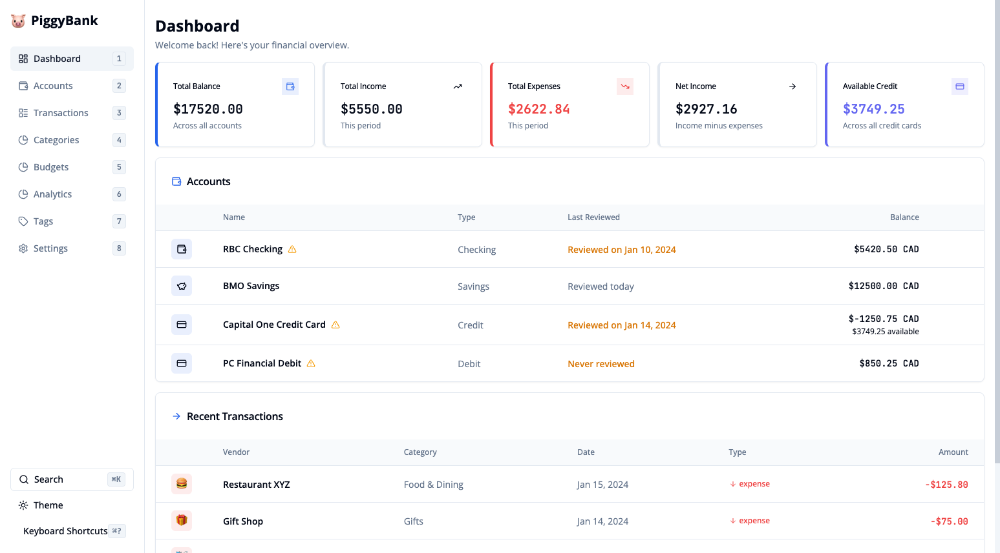

# PiggyBank 🐷

<div align="center">


**Client-side personal finance management • IndexedDB storage • Zero backend**

[Features](#features) • [Quick Start](#quick-start) • [Architecture](#architecture) • [Contributing](#contributing)



</div>

---

## Overview

PiggyBank is a client-side personal finance application built with React and TypeScript. All data persists locally via IndexedDB (Dexie), requiring no backend infrastructure. The application operates entirely offline after initial load.

**⚠️ Note**: This project is maintained for personal use. Breaking changes may occur without notice. Fork for stability guarantees.

## Features

- **Account Management**: Multi-type accounts (checking, savings, credit, debit, investment) with debt repayment calculator
- **Transaction Tracking**: CRUD operations with date-based organization, Excel-like table layout, categorization, and tagging
- **Budget System**: Category-specific budgets with flexible periods (weekly/monthly/yearly) and progress tracking
- **Analytics**: Interactive charts (Recharts) for spending analysis, category breakdowns, tag-based filtering
- **Data Management**: JSON import/export, keyboard shortcuts, dark mode
- **Privacy**: Zero network requests after initial load, no telemetry, no cloud storage

## Quick Start

### Prerequisites

- Node.js ≥18.0
- npm ≥9.0

### Installation

```bash
git clone <repository-url>
cd PiggyBank
npm install
npm run dev
```

Open [http://localhost:5173](http://localhost:5173)

### Build & Test

```bash
npm run build          # Production build → dist/
npm test               # Run tests
npm run test:coverage  # Coverage report
npm run test:ui        # Vitest UI
npm run lint           # ESLint
```

## Architecture

### Technology Stack

| Layer | Technology |
|-------|-----------|
| **Framework** | React 18.3 (functional components, hooks) |
| **Language** | TypeScript 5.2 (strict mode) |
| **Build** | Vite 5 (ESM, HMR) |
| **State** | Redux Toolkit (RTK slices, typed hooks) |
| **Routing** | React Router 6 |
| **Styling** | Tailwind CSS 3 + Radix UI primitives |
| **Charts** | Recharts |
| **Database** | Dexie 4 (IndexedDB wrapper) |
| **Forms** | React Hook Form + Zod validation |
| **Testing** | Vitest + Testing Library (happy-dom) |

### Project Structure

```
src/
├── components/        # Reusable UI (keyboard, layout, search, theme, transactions, ui)
├── features/         # Feature modules (accounts, analytics, budgets, categories, dashboard, settings, tags, transactions)
├── store/            # Redux store + slices (accounts, budgets, categories, tags, transactions)
├── db/               # Dexie database services (accountsService, budgetsService, categoriesService, tagsService, transactionsService)
├── lib/              # Utilities (dateHelpers, debtCalculator, fuzzySearch, importExportService, validation)
└── types/            # TypeScript definitions (banks, constants, index)
```

### Data Flow

1. **Storage**: Dexie manages IndexedDB tables for accounts, transactions, categories, budgets, tags
2. **State**: Redux Toolkit slices sync with IndexedDB via service layer
3. **UI**: React components consume Redux state via typed hooks (`useAppSelector`, `useAppDispatch`)
4. **Validation**: Zod schemas validate forms and data before persistence

### Key Design Decisions

- **Client-side only**: No API layer, all operations are synchronous IndexedDB calls
- **Redux for state**: Centralized state management with RTK Query patterns (without RTK Query)
- **Type safety**: Strict TypeScript with discriminated unions for account/transaction types
- **Component composition**: Radix UI primitives + Tailwind for accessible, customizable UI
- **Form handling**: React Hook Form with Zod resolvers for type-safe validation

## Contributing

### Development Workflow

1. Fork and clone
2. Create feature branch: `git checkout -b feature/name`
3. Make changes following existing patterns
4. Write tests for new features
5. Run `npm run lint` and `npm test`
6. Submit PR with clear description

### Code Style

- TypeScript strict mode, avoid `any`
- Functional components with hooks
- ESLint configured (React hooks rules)
- Meaningful names, comments for complex logic
- Follow existing project structure

### Testing

- Unit tests for utilities (`lib/`) and hooks
- Integration tests for features
- Use Testing Library best practices
- Maintain coverage on new code

## Privacy & Data Storage

- **No backend**: Pure client-side application
- **IndexedDB**: All data stored locally in browser
- **Offline-first**: Works without network after initial load
- **No telemetry**: Zero analytics or tracking
- **Export**: JSON export available for backup/migration

## License

MIT License - see [LICENSE](LICENSE)

---

<div align="center">

Made with ❤️ using React, TypeScript, and Vite

</div>
