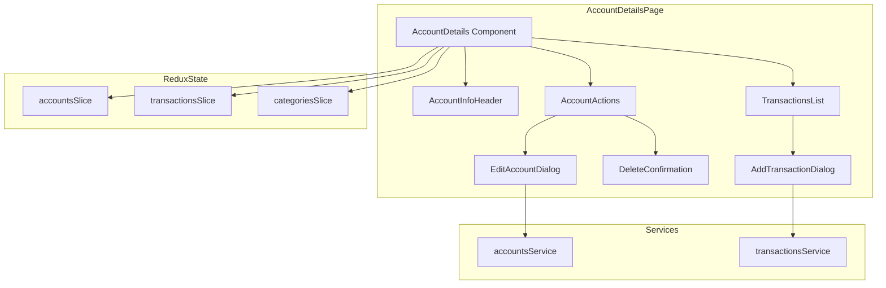
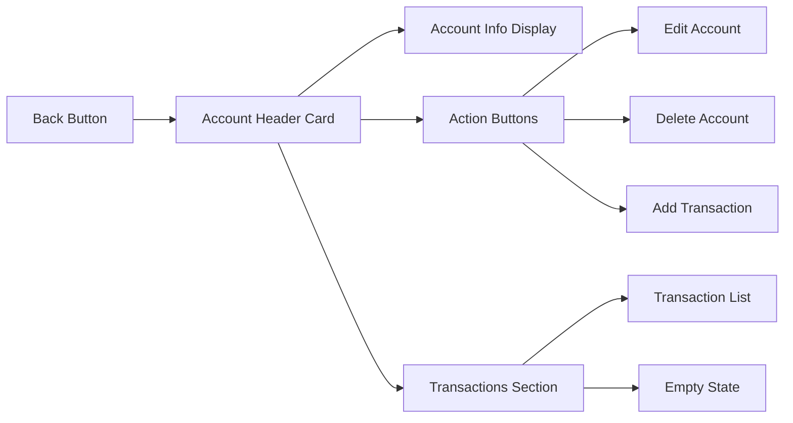
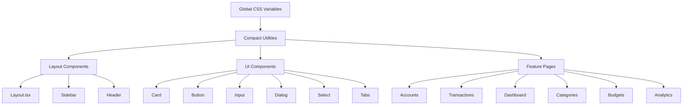

# Account Details Page & Compact Styling Plan

## Overview
This plan details the implementation of a dedicated account details page and comprehensive compact styling improvements for the PiggyBank application, which is a desktop-only application.

---

## Part 1: Account Details Page

### Requirements
- Dedicated page at `/accounts/:id` for viewing and managing individual accounts
- View account information (name, type, balance, currency, color, icon, dates)
- Modify account details via edit dialog
- Delete account with confirmation
- View all transactions related to the account (filtered list)
- Create transactions directly inside the account (pre-filled with account ID)

### Architecture Diagram



### Page Layout Structure



### Component Structure

```
src/features/accounts/
├── Accounts.tsx                    # Existing - list view
├── AccountDetails.tsx              # NEW - details page
└── components/
    ├── AccountInfoHeader.tsx       # NEW - account info display
    ├── AccountActions.tsx          # NEW - action buttons
    ├── EditAccountDialog.tsx       # NEW - edit account form
    └── DeleteAccountDialog.tsx     # NEW - delete confirmation
```

### Route Configuration

```typescript
// Add to Layout.tsx routes
<Route path="/accounts/:id" element={<AccountDetails />} />
```

### Account Details Page Features

#### 1. Account Info Header
- Display account name, type, balance, currency
- Show account icon and color
- Display created/updated dates
- Visual indicator for account type (checking, savings, credit, etc.)

#### 2. Account Actions
- **Edit Account**: Opens dialog with pre-filled form
- **Delete Account**: Opens confirmation dialog with warning
- **Add Transaction**: Opens transaction dialog with account pre-selected

#### 3. Transactions List
- Filtered to show only transactions for this account
- Same styling as main Transactions page
- Quick actions (edit, delete) on hover
- Empty state when no transactions exist

#### 4. Navigation
- Back button to return to accounts list
- Breadcrumb navigation (Accounts > [Account Name])

### State Management

```typescript
// AccountDetails component will use:
const { id } = useParams<{ id: string }>();
const account = useAppSelector(state => state.accounts.accounts.find(a => a.id === id));
const accountTransactions = useAppSelector(state => 
  state.transactions.transactions.filter(t => t.accountId === id)
);
```

---

## Part 2: Compact Styling

### Design Philosophy
Since PiggyBank is desktop-only, we can:
- Reduce padding and margins throughout
- Use smaller font sizes
- Tighter spacing between elements
- Smaller icons and buttons
- More dense information display
- Remove mobile-specific responsive breakpoints

### Compact Styling Strategy



### CSS Changes

#### 1. Global Compact Utilities (index.css)

```css
/* Compact spacing utilities */
.compact-p-2 { padding: 0.5rem; }
.compact-p-3 { padding: 0.75rem; }
.compact-p-4 { padding: 1rem; }
.compact-gap-2 { gap: 0.5rem; }
.compact-gap-3 { gap: 0.75rem; }

/* Compact typography */
.compact-text-sm { font-size: 0.875rem; }
.compact-text-xs { font-size: 0.75rem; }
.compact-text-lg { font-size: 1rem; }
.compact-text-xl { font-size: 1.125rem; }

/* Compact icons */
.compact-icon-sm { width: 1rem; height: 1rem; }
.compact-icon-md { width: 1.25rem; height: 1.25rem; }
```

#### 2. Layout Component Changes

**Sidebar (Layout.tsx):**
- Width: `w-64` → `w-56` (14rem)
- Padding: `p-4` → `p-3`
- Nav items: `py-3` → `py-2`, `px-4` → `px-3`

**Header:**
- Padding: `p-4 lg:p-8` → `p-3 lg:p-4`
- Title: `text-4xl` → `text-2xl`

**Main Content:**
- Padding: `p-4 lg:p-8` → `p-3 lg:p-4`

#### 3. UI Component Changes

**Card (card.tsx):**
- CardHeader: `p-6` → `p-3`
- CardContent: `p-6 pt-0` → `p-3 pt-0`
- CardTitle: `text-2xl` → `text-lg`

**Button (button.tsx):**
- default: `h-10 px-4 py-2` → `h-8 px-3 py-1.5`
- sm: `h-9 rounded-md px-3 text-xs` → `h-7 rounded px-2 text-xs`
- lg: `h-11 rounded-lg px-8 text-base` → `h-9 rounded px-6 text-sm`
- icon: `h-10 w-10` → `h-8 w-8`

**Input (input.tsx):**
- Height: `h-10` → `h-8`
- Padding: `px-3 py-2` → `px-2.5 py-1.5`

**Dialog (dialog.tsx):**
- DialogContent: `p-6` → `p-4`
- DialogTitle: `text-xl` → `text-lg`

**Select (select.tsx):**
- SelectTrigger: `h-10 px-3 py-2` → `h-8 px-2.5 py-1.5`
- SelectContent: `p-1` → `p-0.5`

#### 4. Feature Page Changes

**Accounts.tsx:**
- Page title: `text-4xl` → `text-2xl`
- Card padding: Reduce from current values
- Icon sizes: `h-6 w-6` → `h-5 w-5`
- Balance: `text-3xl` → `text-xl`

**Transactions.tsx:**
- Page title: `text-4xl` → `text-2xl`
- Transaction item padding: `p-4` → `p-3`
- Icon sizes: `h-12 w-12` → `h-10 w-10`
- Amount: `text-xl` → `text-lg`

**Dashboard.tsx:**
- Page title: `text-4xl` → `text-2xl`
- Summary card padding: Reduce
- Metric values: `text-3xl` → `text-xl`

### Tailwind Config Extensions

Consider adding custom compact spacing scale:

```javascript
// tailwind.config.js
theme: {
  extend: {
    spacing: {
      'compact-xs': '0.25rem',
      'compact-sm': '0.5rem',
      'compact-md': '0.75rem',
      'compact-lg': '1rem',
    },
    fontSize: {
      'compact-xs': '0.75rem',
      'compact-sm': '0.875rem',
      'compact-base': '1rem',
      'compact-lg': '1.125rem',
      'compact-xl': '1.25rem',
    }
  }
}
```

---

## Implementation Order

### Phase 1: Account Details Page
1. Create AccountDetails.tsx component
2. Add route configuration
3. Make account cards clickable in Accounts.tsx
4. Implement account info header
5. Implement edit account dialog
6. Implement delete account functionality
7. Implement filtered transactions list
8. Implement add transaction dialog
9. Add back navigation

### Phase 2: Compact Styling - Foundation
1. Add compact utilities to index.css
2. Update Tailwind config if needed
3. Update Layout component (sidebar, header, main)

### Phase 3: Compact Styling - UI Components
1. Update Card component
2. Update Button component
3. Update Input component
4. Update Dialog component
5. Update Select component
6. Update other UI components (Label, Tabs, etc.)

### Phase 4: Compact Styling - Feature Pages
1. Update Accounts.tsx
2. Update Transactions.tsx
3. Update Dashboard.tsx
4. Update Categories.tsx
5. Update Budgets.tsx
6. Update Analytics.tsx
7. Update Settings.tsx

---

## Files to Create

```
src/features/accounts/
├── AccountDetails.tsx              # NEW
└── components/
    ├── AccountInfoHeader.tsx       # NEW
    ├── AccountActions.tsx          # NEW
    ├── EditAccountDialog.tsx       # NEW
    └── DeleteAccountDialog.tsx     # NEW
```

## Files to Modify

```
src/components/layout/Layout.tsx    # Add route, compact styling
src/components/ui/card.tsx         # Compact padding
src/components/ui/button.tsx       # Compact sizing
src/components/ui/input.tsx        # Compact sizing
src/components/ui/dialog.tsx       # Compact sizing
src/components/ui/select.tsx       # Compact sizing
src/components/ui/label.tsx        # Compact sizing
src/components/ui/tabs.tsx         # Compact sizing
src/features/accounts/Accounts.tsx  # Clickable cards, compact styling
src/features/transactions/Transactions.tsx  # Compact styling
src/features/dashboard/Dashboard.tsx        # Compact styling
src/features/categories/Categories.tsx     # Compact styling
src/index.css                      # Add compact utilities
```

---

## Key Considerations

1. **Desktop-Only Focus**: No need for mobile breakpoints, can use fixed sizes
2. **Information Density**: More data visible on screen at once
3. **Consistency**: Apply compact styling uniformly across all components
4. **Accessibility**: Ensure smaller elements remain clickable and readable
5. **User Experience**: Balance compactness with usability - don't make things too small
6. **Keyboard Navigation**: Ensure tab order and focus states work with compact layout

---

## Testing Checklist

### Account Details Page
- [ ] Navigate to account details from accounts list
- [ ] View all account information correctly
- [ ] Edit account details and save
- [ ] Delete account with confirmation
- [ ] View filtered transactions for account
- [ ] Add transaction from account details page
- [ ] Back button returns to accounts list
- [ ] Handle non-existent account IDs gracefully

### Compact Styling
- [ ] All pages use consistent compact spacing
- [ ] Text remains readable at smaller sizes
- [ ] Buttons and inputs are still easily clickable
- [ ] Icons are appropriately sized
- [ ] Layout looks balanced and professional
- [ ] No overflow or layout issues
- [ ] Dark mode works correctly with compact styles
