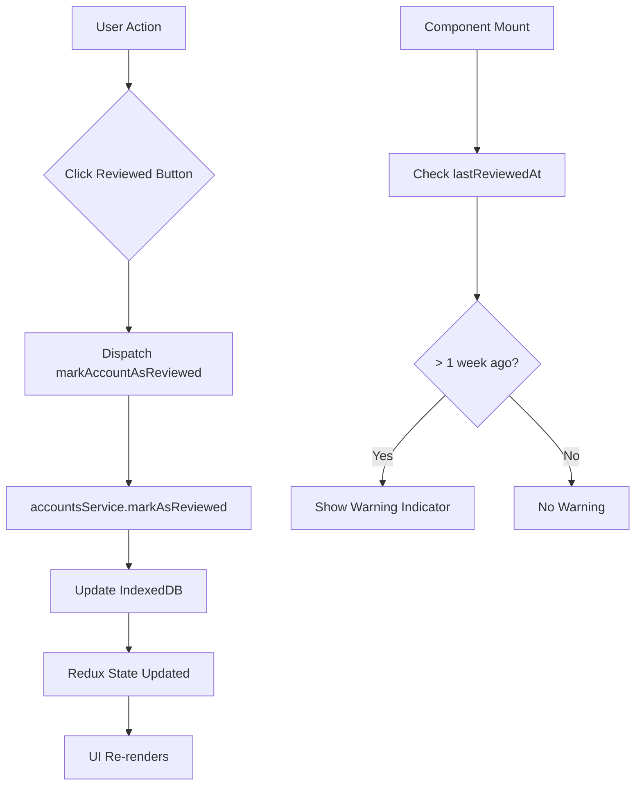

# Account Review Feature Plan

## Overview
Add a "last reviewed time" feature to accounts that allows users to track when they last reviewed their financial accounts. This includes a warning indicator when an account hasn't been reviewed in over a week, and a "Reviewed" button to mark accounts as reviewed.

## Architecture Diagram

## Implementation Steps

### 1. Type Definitions
**File:** [`src/types/index.ts`](src/types/index.ts)
- Add `lastReviewedAt?: Date` to [`Account`](src/types/index.ts:4) interface
- Update [`AccountFormData`](src/types/index.ts:16) if needed for form handling

### 2. Database Schema
**File:** [`src/db/index.ts`](src/db/index.ts)
- Increment `DB_VERSION` from 1 to 2
- Add `lastReviewedAt` to accounts table indexes
- Add migration logic to handle existing accounts

### 3. Service Layer
**File:** [`src/db/services/accountsService.ts`](src/db/services/accountsService.ts)
- Add `markAsReviewed(id: string)` method to update `lastReviewedAt` to current time
- Update [`create()`](src/db/services/accountsService.ts:13) method to initialize `lastReviewedAt` to `createdAt`

### 4. Redux Store
**File:** [`src/store/slices/accountsSlice.ts`](src/store/slices/accountsSlice.ts)
- Add `markAccountAsReviewed` async thunk
- Handle the fulfilled state to update the account in the store

### 5. Utility Functions
**File:** [`src/lib/utils.ts`](src/lib/utils.ts)
- Add `isAccountNeedsReview(lastReviewedAt: Date | undefined): boolean` - returns true if > 1 week ago
- Add `formatLastReviewed(lastReviewedAt: Date | undefined): string` - returns human-readable time

### 6. UI Components - Accounts Page
**File:** [`src/features/accounts/Accounts.tsx`](src/features/accounts/Accounts.tsx)
- Add warning indicator (icon/badge) to account card when `isAccountNeedsReview()` returns true
- Add "Reviewed" button to each account card
- Wire up button to dispatch `markAccountAsReviewed` action

### 7. UI Components - Account Details Page
**File:** [`src/features/accounts/AccountDetails.tsx`](src/features/accounts/AccountDetails.tsx)
- Add warning indicator in the account header when review is needed
- Add "Reviewed" button in the account header
- Wire up button to dispatch `markAccountAsReviewed` action

## UI Design Specifications

### Warning Indicator
- Display a warning icon (e.g., `AlertTriangle` from lucide-react) with yellow/amber color
- Show tooltip on hover: "This account hasn't been reviewed in over a week"
- Position: Top-right corner of account card / header

### Reviewed Button
- Icon: `CheckCircle` from lucide-react
- Style: Small button, outline variant, green color on hover
- Position: Near the delete button on account card, in the header on details page

### Last Reviewed Display
- Show "Last reviewed: X days ago" or "Last reviewed: Today/Yesterday"
- Position: Below the account type/balance information

## Data Flow

1. **Initial Load**: Accounts are fetched from IndexedDB with `lastReviewedAt` field
2. **Render Check**: Each component checks if `lastReviewedAt` is > 1 week ago
3. **Warning Display**: If true, show warning indicator
4. **User Action**: User clicks "Reviewed" button
5. **Update**: Dispatch action → Service updates DB → Redux updates → UI re-renders

## Migration Strategy

For existing accounts without `lastReviewedAt`:
- Treat as "never reviewed" (show warning)
- When first reviewed, set `lastReviewedAt` to current time
- Alternatively, could set to `createdAt` as a default

## Files to Modify

1. `src/types/index.ts` - Type definitions
2. `src/types/constants.ts` - DB_VERSION constant
3. `src/db/index.ts` - Database schema
4. `src/db/services/accountsService.ts` - Service methods
5. `src/store/slices/accountsSlice.ts` - Redux actions
6. `src/lib/utils.ts` - Utility functions
7. `src/features/accounts/Accounts.tsx` - Accounts list page
8. `src/features/accounts/AccountDetails.tsx` - Account details page
