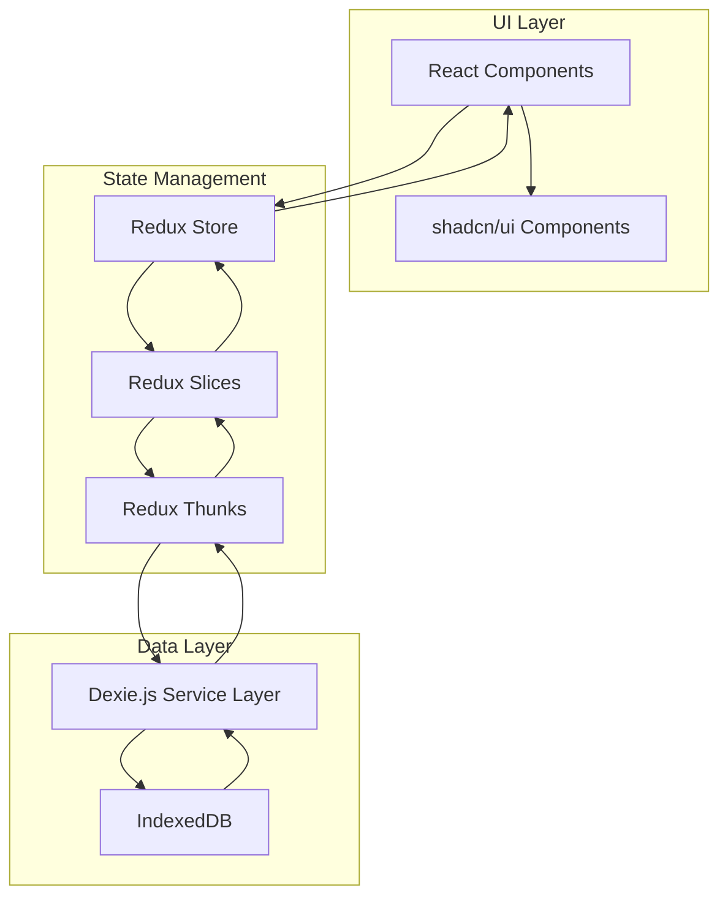
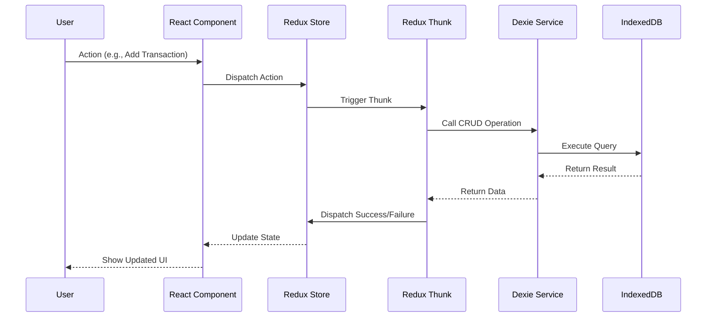
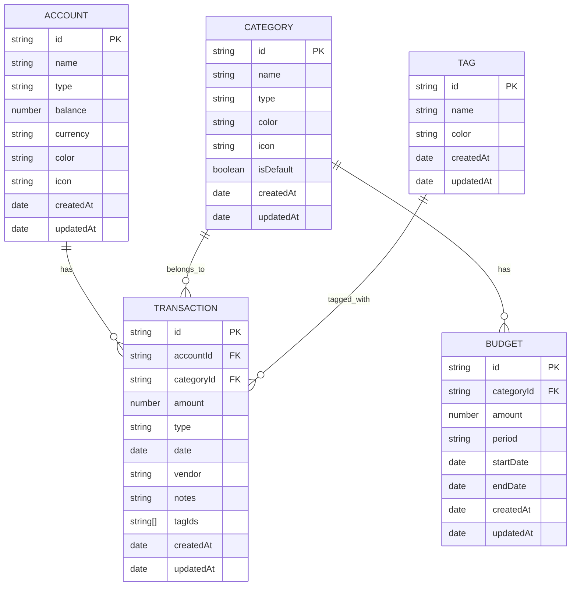

# PiggyBank - Personal Finance App Architecture

## Technology Stack

| Category | Technology | Purpose |
|----------|-----------|---------|
| Framework | React 18 + TypeScript | UI framework with type safety |
| Build Tool | Vite | Fast development server and bundler |
| Styling | Tailwind CSS | Utility-first CSS framework |
| UI Components | shadcn/ui | Pre-built accessible components |
| State Management | Redux Toolkit | Predictable state container |
| Routing | React Router | Client-side routing |
| Data Storage | IndexedDB (via Dexie.js) | Browser-based persistent storage |
| Charts | Recharts | Analytics visualization |
| Form Handling | React Hook Form + Zod | Form validation |
| Date Handling | date-fns | Date manipulation and formatting |

## Project Structure

```
PiggyBank/
├── src/
│   ├── components/           # Reusable UI components
│   │   ├── ui/              # shadcn/ui components
│   │   ├── layout/          # Layout components (Header, Sidebar, etc.)
│   │   └── common/          # Shared components (Cards, Modals, etc.)
│   ├── features/            # Feature-based modules
│   │   ├── accounts/        # Account management
│   │   │   ├── components/
│   │   │   ├── hooks/
│   │   │   └── types.ts
│   │   ├── transactions/    # Transaction management
│   │   │   ├── components/
│   │   │   ├── hooks/
│   │   │   └── types.ts
│   │   ├── categories/      # Category management
│   │   │   ├── components/
│   │   │   ├── hooks/
│   │   │   └── types.ts
│   │   ├── budgets/         # Budget management
│   │   │   ├── components/
│   │   │   ├── hooks/
│   │   │   └── types.ts
│   │   ├── tags/            # Tag management
│   │   │   ├── components/
│   │   │   ├── hooks/
│   │   │   └── types.ts
│   │   ├── analytics/       # Analytics dashboard
│   │   │   ├── components/
│   │   │   ├── hooks/
│   │   │   └── types.ts
│   │   └── settings/        # Settings (import/export)
│   │       ├── components/
│   │       └── hooks/
│   ├── store/               # Redux store configuration
│   │   ├── index.ts         # Store setup
│   │   ├── hooks.ts         # Typed hooks
│   │   └── slices/          # Redux slices
│   │       ├── accountsSlice.ts
│   │       ├── transactionsSlice.ts
│   │       ├── categoriesSlice.ts
│   │       ├── budgetsSlice.ts
│   │       └── tagsSlice.ts
│   ├── db/                  # IndexedDB layer
│   │   ├── index.ts         # Dexie database setup
│   │   └── services/        # CRUD operations
│   │       ├── accountsService.ts
│   │       ├── transactionsService.ts
│   │       ├── categoriesService.ts
│   │       ├── budgetsService.ts
│   │       └── tagsService.ts
│   ├── types/               # Shared TypeScript types
│   │   ├── index.ts         # Core entity types
│   │   └── constants.ts     # Default values, enums
│   ├── utils/               # Utility functions
│   │   ├── formatters.ts    # Currency, date formatters
│   │   ├── validators.ts    # Validation helpers
│   │   └── exportImport.ts  # Export/import logic
│   ├── App.tsx              # Root component
│   ├── main.tsx             # Application entry point
│   └── index.css            # Global styles
├── public/                  # Static assets
├── plans/                   # Architecture and planning docs
└── package.json
```

## Data Model

### Core Entities

```typescript
// Account
interface Account {
  id: string;
  name: string;
  type: 'checking' | 'savings' | 'credit' | 'debit' | 'investment';
  balance: number;
  currency: string;
  color?: string;
  icon?: string;
  createdAt: Date;
  updatedAt: Date;
}

// Category
interface Category {
  id: string;
  name: string;
  type: 'income' | 'expense';
  color: string;
  icon?: string;
  isDefault: boolean;
  createdAt: Date;
  updatedAt: Date;
}

// Tag
interface Tag {
  id: string;
  name: string;
  color: string;
  createdAt: Date;
  updatedAt: Date;
}

// Transaction
interface Transaction {
  id: string;
  accountId: string;
  categoryId: string;
  amount: number;
  type: 'income' | 'expense';
  date: Date;
  vendor: string;
  notes?: string;
  tagIds: string[];
  createdAt: Date;
  updatedAt: Date;
}

// Budget
interface Budget {
  id: string;
  categoryId: string;
  amount: number;
  period: 'monthly' | 'weekly' | 'yearly';
  startDate: Date;
  endDate?: Date;
  createdAt: Date;
  updatedAt: Date;
}
```

### Default Categories

| Name | Type | Color |
|------|------|-------|
| Salary | Income | Green |
| Freelance | Income | Emerald |
| Investments | Income | Blue |
| Other Income | Income | Slate |
| Housing | Expense | Red |
| Food & Dining | Expense | Orange |
| Transportation | Expense | Yellow |
| Utilities | Expense | Purple |
| Entertainment | Expense | Pink |
| Shopping | Expense | Rose |
| Health | Expense | Cyan |
| Education | Expense | Indigo |
| Personal Care | Expense | Amber |
| Travel | Expense | Teal |
| Gifts | Expense | Violet |
| Other Expense | Expense | Gray |

## Architecture Diagrams

### Application Flow



### Data Flow



### Redux Store Structure

```mermaid
graph TD
    A[Root Store] --> B[accountsSlice]
    A --> C[transactionsSlice]
    A --> D[categoriesSlice]
    A --> E[budgetsSlice]
    A --> F[tagsSlice]
    
    B --> B1[accounts: Account[]]
    B --> B2[loading: boolean]
    B --> B3[error: string | null]
    
    C --> C1[transactions: Transaction[]]
    C --> C2[filters: TransactionFilters]
    C --> C3[loading: boolean]
    C --> C4[error: string | null]
    
    D --> D1[categories: Category[]]
    D --> D2[loading: boolean]
    D --> D3[error: string | null]
    
    E --> E1[budgets: Budget[]]
    E --> E2[loading: boolean]
    E --> E3[error: string | null]
    
    F --> F1[tags: Tag[]]
    F --> F2[loading: boolean]
    F --> F3[error: string | null]
```

### IndexedDB Schema



### Application Routes

```mermaid
graph LR
    A[/] --> B[Dashboard]
    A --> C[/accounts]
    A --> D[/transactions]
    A --> E[/categories]
    A --> F[/budgets]
    A --> G[/analytics]
    A --> H[/settings]
    
    C --> C1[Accounts List]
    C --> C2[Add/Edit Account]
    
    D --> D1[Transactions List]
    D --> D2[Add/Edit Transaction]
    
    E --> E1[Categories List]
    E --> E2[Add/Edit Category]
    
    F --> F1[Budgets Overview]
    F --> F2[Set/Edit Budget]
    
    G --> G1[Monthly Analytics]
    G --> G2[Weekly Analytics]
    G --> G3[Yearly Analytics]
    
    H --> H1[Import Data]
    H --> H2[Export Data]
```

## Key Features Implementation

### 1. Accounts Management
- List all accounts with balance summary
- Add new account (name, type, initial balance, color, icon)
- Edit account details
- Delete account (with confirmation)
- Account type badges (checking, savings, credit, debit, investment)

### 2. Transactions Management
- Add transaction form with:
  - Date picker
  - Account selector
  - Category selector (filtered by type)
  - Amount input
  - Vendor input
  - Tag multi-select
  - Notes textarea
- Transaction list with filters:
  - Date range
  - Account
  - Category
  - Tags
  - Type (income/expense)
- Edit and delete transactions
- Bulk actions (delete multiple)

### 3. Categories Management
- List all categories grouped by type (income/expense)
- Add custom category
- Edit category (name, color, icon)
- Delete category (prevent if used in transactions)
- Default categories (non-deletable)

### 4. Budgets Management
- Set budget per category
- Budget period selection (monthly, weekly, yearly)
- Budget vs actual comparison
- Progress bars showing budget usage
- Over-budget indicators

### 5. Analytics Dashboard
- Monthly, weekly, yearly views
- Income vs Expense charts (bar/line)
- Category breakdown (pie/doughnut)
- Spending trends over time
- Top vendors
- Budget performance

### 6. Import/Export
- Export all data to JSON
- Import data from JSON with validation:
  - Schema validation
  - Duplicate detection
  - Merge or replace options
- Backup/restore functionality

## Development Considerations

### Performance
- Use React.memo for expensive components
- Implement virtual scrolling for large transaction lists
- Debounce search/filter inputs
- Lazy load charts and heavy components

### Accessibility
- All shadcn/ui components are accessible by default
- Keyboard navigation support
- ARIA labels for custom components
- Color contrast compliance

### Error Handling
- Global error boundary
- IndexedDB error handling (quota exceeded, etc.)
- Form validation with Zod
- User-friendly error messages

### Responsive Design
- Mobile-first approach
- Sidebar navigation on desktop, bottom nav on mobile
- Responsive tables and cards
- Touch-friendly interactions

### Security
- Input sanitization
- XSS prevention
- Secure export/import (validate all data)
- No sensitive data in localStorage
