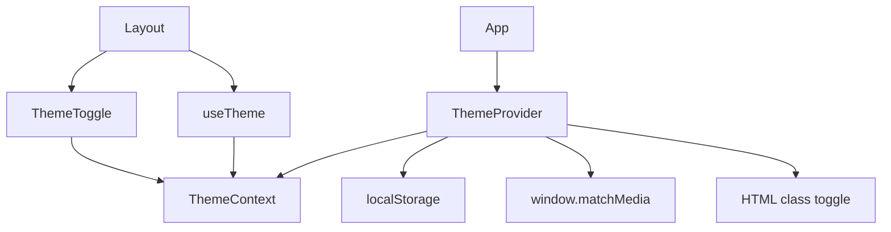

# Dark Mode Implementation Plan

## Overview
Add dark mode support with a toggle button on the sidebar. The project already has Tailwind configured for class-based dark mode (`darkMode: ["class"]`) and CSS variables for both light and dark themes.

## Current State Analysis

### Existing Configuration
- **Tailwind Config**: Already configured with `darkMode: ["class"]` in [`tailwind.config.js`](../tailwind.config.js:3)
- **CSS Variables**: Light theme variables defined in `:root` (lines 6-38) and dark theme in `.dark` class (lines 40-71) in [`src/index.css`](../src/index.css:1)
- **Layout**: Sidebar component exists in [`src/components/layout/Layout.tsx`](../src/components/layout/Layout.tsx:1) with bottom action buttons section (lines 141-162)

### What's Missing
1. Theme state management (context + hook)
2. Theme provider to wrap the app
3. Dark mode toggle component
4. Integration with sidebar
5. localStorage persistence for user preference
6. System preference detection

## Implementation Steps

### 1. Create Theme Context and Hook
**File**: `src/components/theme/ThemeProvider.tsx`

Create a context provider that:
- Manages theme state (`"light"` | `"dark"` | `"system"`)
- Detects system preference using `window.matchMedia('(prefers-color-scheme: dark)')`
- Persists user preference to localStorage (`theme` key)
- Applies/removes `dark` class from `<html>` element
- Provides `theme` state and `setTheme` function

```typescript
interface ThemeContextType {
  theme: "light" | "dark" | "system"
  setTheme: (theme: "light" | "dark" | "system") => void
}
```

### 2. Create useTheme Hook
**File**: `src/components/theme/useTheme.ts`

Custom hook that:
- Accesses theme context
- Throws error if used outside ThemeProvider
- Returns theme state and setter function

### 3. Create ThemeToggle Component
**File**: `src/components/theme/ThemeToggle.tsx`

Button component that:
- Uses `useTheme` hook
- Shows Sun icon when dark mode is active
- Shows Moon icon when light mode is active
- Shows System icon when using system preference
- Uses the existing `Button` component from `@/components/ui/button`
- Includes tooltip showing current mode
- Smooth transition animation between icons

Icons from `lucide-react`:
- `Sun` - for light mode
- `Moon` - for dark mode
- `Monitor` - for system preference

### 4. Update main.tsx
**File**: `src/main.tsx`

Wrap the app with `ThemeProvider`:
```tsx
import { ThemeProvider } from './components/theme/ThemeProvider'

ReactDOM.createRoot(document.getElementById('root')!).render(
  <React.StrictMode>
    <ThemeProvider>
      <App />
    </ThemeProvider>
  </React.StrictMode>,
)
```

### 5. Add ThemeToggle to Sidebar
**File**: `src/components/layout/Layout.tsx`

Add the toggle button in the sidebar's bottom section (after the existing buttons, around line 161):
- Import `ThemeToggle` component
- Place it in the bottom action buttons area
- Keep consistent styling with other sidebar buttons

### 6. Add Keyboard Shortcut (Optional Enhancement)
Add a keyboard shortcut to toggle dark mode:
- Shortcut: `Ctrl/Cmd + Shift + D`
- Register using existing `useRegisterShortcut` hook
- Add to keyboard help dialog

## Architecture Diagram



## File Structure

```
src/
├── components/
│   ├── layout/
│   │   └── Layout.tsx (modify)
│   ├── theme/
│   │   ├── ThemeProvider.tsx (new)
│   │   ├── useTheme.ts (new)
│   │   └── ThemeToggle.tsx (new)
├── main.tsx (modify)
```

## Technical Details

### Theme Resolution Logic
1. Check if theme is explicitly set to "light" or "dark"
2. If "system", check `window.matchMedia('(prefers-color-scheme: dark)')`
3. Apply `dark` class to `<html>` element if resolved theme is dark

### localStorage Key
- Key: `theme`
- Values: `"light"`, `"dark"`, `"system"`

### CSS Class Application
- Light mode: Remove `dark` class from `<html>`
- Dark mode: Add `dark` class to `<html>`

## Benefits
1. **User Control**: Users can override system preference
2. **Persistence**: Theme choice saved across sessions
3. **System Awareness**: Defaults to system preference
4. **Consistent Styling**: Uses existing CSS variables
5. **Easy Toggle**: Accessible button in sidebar
