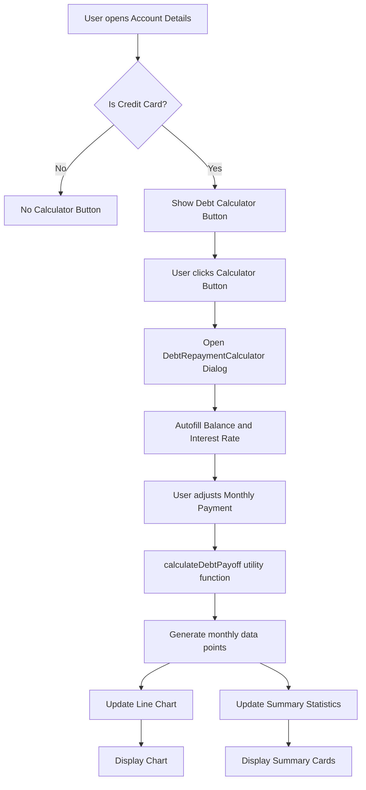

# Debt Repayment Calculator Feature Plan

## Overview
Add a debt repayment calculator tool that can be opened within each credit card account details page. The calculator will autofill with current balance and interest rate, allow users to adjust monthly payments, and display a line chart showing how the debt will be paid off over time.

## Requirements
- Accessible from credit card account details page only
- Autofill balance and interest rate from current account data
- Allow users to modify monthly payment amount
- Display line chart showing debt payoff timeline
- Show summary statistics (months to payoff, total interest, total paid)

## Technical Architecture

### Components to Create

#### 1. Slider UI Component (`src/components/ui/slider.tsx`)
- A reusable slider component using Radix UI primitives
- Supports min, max, step, and default values
- Styled with Tailwind CSS to match existing UI
- Follows the same pattern as other UI components (button, input, etc.)

#### 2. Debt Repayment Calculator Component (`src/features/accounts/DebtRepaymentCalculator.tsx`)
**Props:**
- `account: Account` - The credit card account data
- `open: boolean` - Controls dialog visibility
- `onOpenChange: (open: boolean) => void` - Dialog open/close handler

**Features:**
- Dialog wrapper using existing [`Dialog`](src/components/ui/dialog.tsx) component
- Form inputs:
  - Balance (autofilled, editable)
  - Interest Rate/APR (autofilled, editable)
  - Monthly Payment (slider + number input)
- Real-time calculation updates as user adjusts values
- Line chart using [`recharts`](package.json:33) showing balance over months
- Summary cards displaying:
  - Months to payoff
  - Total interest paid
  - Total amount paid

#### 3. Utility Function (`src/lib/debtCalculator.ts`)
```typescript
interface DebtPayoffResult {
  monthlyPayment: number;
  monthsToPayoff: number;
  totalInterest: number;
  totalPaid: number;
  monthlyData: Array<{
    month: number;
    balance: number;
    payment: number;
    interest: number;
    principal: number;
  }>;
}

function calculateDebtPayoff(
  principal: number,
  annualRate: number,
  monthlyPayment: number
): DebtPayoffResult | null
```

**Calculation Logic:**
- Monthly interest rate = annualRate / 100 / 12
- For each month:
  - Interest = balance × monthly rate
  - Principal = monthlyPayment - interest
  - New balance = balance - principal
- Stop when balance ≤ 0 or if monthly payment < minimum interest

### Integration Point

#### AccountDetails Component Modifications
Add a new button in the credit card details section to open the calculator:

```tsx
{isCreditCard && account.creditCardDetails?.interestRate && (
  <Dialog open={isCalculatorOpen} onOpenChange={setIsCalculatorOpen}>
    <DialogTrigger asChild>
      <Button size="sm" variant="outline">
        <Calculator className="h-4 w-4 mr-2" />
        Debt Calculator
      </Button>
    </DialogTrigger>
    <DialogContent className="max-w-2xl">
      <DebtRepaymentCalculator
        account={account}
        open={isCalculatorOpen}
        onOpenChange={setIsCalculatorOpen}
      />
    </DialogContent>
  </Dialog>
)}
```

Placement: Add this button near the existing "Reviewed" and "Edit" buttons in the account header.

## Data Flow



## UI/UX Design

### Dialog Layout
```
┌─────────────────────────────────────────────────┐
│ Debt Repayment Calculator          [X]         │
├─────────────────────────────────────────────────┤
│                                                 │
│ Account: Chase Sapphire Reserve                 │
│                                                 │
│ ┌───────────────────────────────────────────┐  │
│ │ Balance:     [$1,500.00      ]           │  │
│ │ Interest:    [18.99%         ]           │  │
│ │                                          │  │
│ │ Monthly Payment:                         │  │
│ │   [$150]  ━━━━━●━━━━━━━━━━━━━━━━━━━━━  │  │
│ │   Min: $15  Max: $500                    │  │
│ └───────────────────────────────────────────┘  │
│                                                 │
│ ┌───────────────────────────────────────────┐  │
│ │ 11 Months to Payoff                        │  │
│ │ Total Interest: $146.50                    │  │
│ │ Total Paid: $1,646.50                     │  │
│ └───────────────────────────────────────────┘  │
│                                                 │
│ ┌───────────────────────────────────────────┐  │
│ │           Balance Over Time                │  │
│ │  ┌─────────────────────────────────────┐ │  │
│ │  │        ╱╲                            │ │  │
│ │  │      ╱    ╲                          │ │  │
│ │  │    ╱        ╲                        │ │  │
│ │  │  ╱            ╲                      │ │  │
│ │  │╱                ╲_____________________│ │  │
│ │  └─────────────────────────────────────┘ │  │
│ │  Month 1    Month 6    Month 11          │  │
│ └───────────────────────────────────────────┘  │
└─────────────────────────────────────────────────┘
```

### Color Scheme
- Primary chart color: `#3b82f6` (blue-500) - matches existing theme
- Success indicators: `#22c55e` (green-500)
- Warning indicators: `#f59e0b` (amber-500)

## Implementation Steps

1. **Create Slider UI Component**
   - File: `src/components/ui/slider.tsx`
   - Use Radix UI Slider primitive
   - Follow existing component patterns

2. **Create Debt Calculation Utility**
   - File: `src/lib/debtCalculator.ts`
   - Implement `calculateDebtPayoff` function
   - Handle edge cases (zero balance, zero interest, insufficient payment)

3. **Create DebtRepaymentCalculator Component**
   - File: `src/features/accounts/DebtRepaymentCalculator.tsx`
   - Build form with autofilled values
   - Integrate slider for monthly payment
   - Add line chart using recharts LineChart
   - Display summary statistics

4. **Integrate into AccountDetails**
   - Modify `src/features/accounts/AccountDetails.tsx`
   - Add state for calculator dialog
   - Add button in credit card account header
   - Pass account data to calculator

5. **Testing**
   - Test with various balance amounts
   - Test with different interest rates
   - Test edge cases (minimum payment, large payments)
   - Verify responsive design on mobile

## Edge Cases to Handle

1. **Zero Balance**: Show message that account is already paid off
2. **Zero Interest Rate**: Calculate without interest component
3. **Monthly Payment < Interest**: Show warning that debt will never be paid off
4. **Missing Interest Rate**: Allow manual entry, default to 0%
5. **Negative Balance**: Handle as credit/overpayment scenario

## Dependencies
- Existing: `recharts` (already installed)
- Existing: `@radix-ui/react-dialog` (already installed)
- New: `@radix-ui/react-slider` (needs to be installed)

## Files to Modify
1. `src/features/accounts/AccountDetails.tsx` - Add calculator button and integration
2. `package.json` - Add `@radix-ui/react-slider` dependency

## Files to Create
1. `src/components/ui/slider.tsx` - Slider UI component
2. `src/features/accounts/DebtRepaymentCalculator.tsx` - Main calculator component
3. `src/lib/debtCalculator.ts` - Debt calculation utility function

## Notes
- The calculator uses the existing [`Dialog`](src/components/ui/dialog.tsx) component for consistent UI
- Chart styling should match the existing [`Analytics`](src/features/analytics/Analytics.tsx) component
- All calculations are client-side only, no persistence needed
- Currency symbol should respect the account's currency setting
