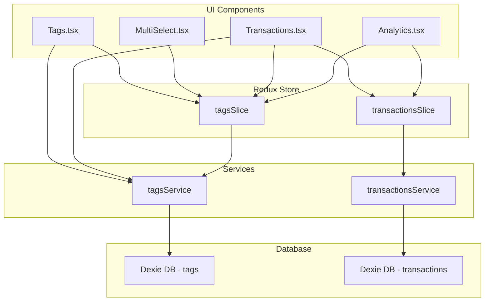

# Tags and Tag Analytics Implementation Plan

## Overview
This plan outlines the implementation of tags for transactions and tag-related analytics. The backend infrastructure (types, services, slices) already exists, so this plan focuses on UI components and analytics features.

## Current State Analysis

### Already Implemented
- **Transaction Types**: [`Transaction`](src/types/index.ts:72) and [`TransactionFormData`](src/types/index.ts:86) already have `tagIds: string[]` field
- **TransactionFilters**: Already has `tagIds?: string[]` for filtering
- **Tags Service**: [`tagsService`](src/db/services/tagsService.ts) provides full CRUD operations
- **Tags Slice**: [`tagsSlice`](src/store/slices/tagsSlice.ts) provides Redux state management
- **Tags are fetched**: [`Layout.tsx`](src/components/layout/Layout.tsx:53) already fetches tags on app load

### Missing Components
1. Tags management UI (create, view, delete tags)
2. Tag selection UI in Transactions component
3. Tag display in transactions table
4. Tag-related analytics in Analytics component

## Implementation Tasks

### 1. Create Tags Management Feature Page
**File**: `src/features/tags/Tags.tsx`

Create a new Tags management page similar to [`Categories.tsx`](src/features/categories/Categories.tsx):
- Display list of all tags with color and name
- Add dialog to create new tags
- Allow deletion of tags
- Show tag color and name in a grid layout

**Key Features**:
- Create tag form with name and color picker
- List all existing tags
- Delete tag functionality
- Responsive grid layout

### 2. Create Multi-Select Component for Tag Selection
**File**: `src/components/ui/multi-select.tsx`

Create a reusable multi-select component for selecting tags:
- Display available tags as checkboxes
- Show selected tags as badges
- Allow adding/removing tags from selection
- Support color display for each tag

**Key Features**:
- Checkbox-based selection
- Visual feedback for selected items
- Color indicator for each tag
- Clear all / Select all functionality

### 3. Add Tag Selection UI to Transactions Component
**File**: `src/features/transactions/Transactions.tsx`

Update the transaction form to include tag selection:
- Add multi-select component to the form
- Load tags from Redux store
- Save selected tag IDs with transaction
- Handle tag selection in both create and edit modes

**Changes**:
- Import tags from Redux store
- Add multi-select component to form after notes field
- Update form state to handle tagIds
- Ensure tagIds are properly saved/loaded

### 4. Display Tags in Transactions Table
**File**: `src/features/transactions/Transactions.tsx`

Update the transactions table to display tags:
- Add tags column to table header
- Display tags as colored badges for each transaction
- Handle multiple tags per transaction
- Show tag colors

**Changes**:
- Add new column in table header
- Render tag badges in table row
- Use tag colors for visual distinction
- Handle empty tag lists gracefully

### 5. Add Tag-Related Analytics to Analytics Component
**File**: `src/features/analytics/Analytics.tsx`

Add tag analytics similar to category analytics:
- Calculate spending by tag (both income and expense)
- Display pie chart for tag spending
- Show tag breakdown list with amounts and percentages
- Add tag filter to analytics (filters all analytics data)

**Changes**:
- Load tags from Redux store
- Calculate tag spending data (include both income and expense)
- Add new card for "Spending by Tag" pie chart
- Add new card for "Tag Breakdown" list
- Add tag filter using multi-select component
- Update AnalyticsData type if needed

### 6. Update Types for Tag Analytics
**File**: `src/types/index.ts`

Add new type for tag spending analytics:

```typescript
export interface TagSpending {
  tagId: string;
  tagName: string;
  amount: number;
  percentage: number;
}

export interface AnalyticsData {
  incomeExpense: IncomeExpenseData[];
  categorySpending: CategorySpending[];
  tagSpending: TagSpending[];
  totalIncome: number;
  totalExpense: number;
  netIncome: number;
}
```

### 7. Add Tags Navigation Route
**File**: `src/components/layout/Layout.tsx`

Add Tags to navigation:
- Add nav item for Tags page
- Add route for Tags page
- Add keyboard shortcut (e.g., '8')

## Architecture Diagram



## Data Flow

### Creating a Transaction with Tags
1. User opens transaction form
2. Multi-select loads available tags from Redux store
3. User selects tags
4. Form submits with tagIds
5. Transaction is saved with tagIds
6. Transaction list updates to show tags

### Viewing Tag Analytics
1. User opens Analytics page
2. Component loads transactions and tags from Redux
3. Calculates spending by tag (both income and expense)
4. Renders pie chart and breakdown list
5. User can select tags from filter to filter all analytics data
6. All analytics (income/expense, categories, tags) update based on selected tags

## Design Considerations

### Visual Design
- Tags should be displayed as colored badges
- Use tag colors consistently across the app
- Tag badges should be compact and readable
- Support multiple tags per transaction

### User Experience
- Multi-select should be intuitive and easy to use
- Tags should be optional on transactions (no limit on number of tags)
- Clear visual feedback for selected tags
- Tag analytics should include both income and expense transactions
- Tag filter in Analytics should filter all analytics data (not just tag analytics)

### Performance
- Tag data is already loaded on app init
- No additional API calls needed for tag data
- Analytics calculations should be efficient

## Testing Checklist
- [ ] Create new tag
- [ ] Delete existing tag
- [ ] Select multiple tags on transaction (no limit)
- [ ] View tags in transaction table
- [ ] Edit transaction tags
- [ ] View tag analytics pie chart (includes both income and expense)
- [ ] View tag breakdown list
- [ ] Filter analytics by tag (all analytics update based on filter)
- [ ] Tags persist after page refresh
- [ ] Empty states display correctly

## Files to Create/Modify

### New Files
1. `src/features/tags/Tags.tsx` - Tags management page
2. `src/components/ui/multi-select.tsx` - Multi-select component

### Modified Files
1. `src/types/index.ts` - Add TagSpending type, update AnalyticsData
2. `src/components/layout/Layout.tsx` - Add Tags navigation and route
3. `src/features/transactions/Transactions.tsx` - Add tag selection and display
4. `src/features/analytics/Analytics.tsx` - Add tag analytics

## Design Decisions (Clarified by User)

### Transaction Tags
- **Tags are optional** on transactions
- **No limit** on the number of tags per transaction

### Tag Analytics
- Tag analytics should include **both income and expense** transactions
- Analytics page will include a **tag filter** to filter all analytics data by selected tags

### Keyboard Shortcut
- Tags page will use shortcut **'8'** (following the existing pattern)
