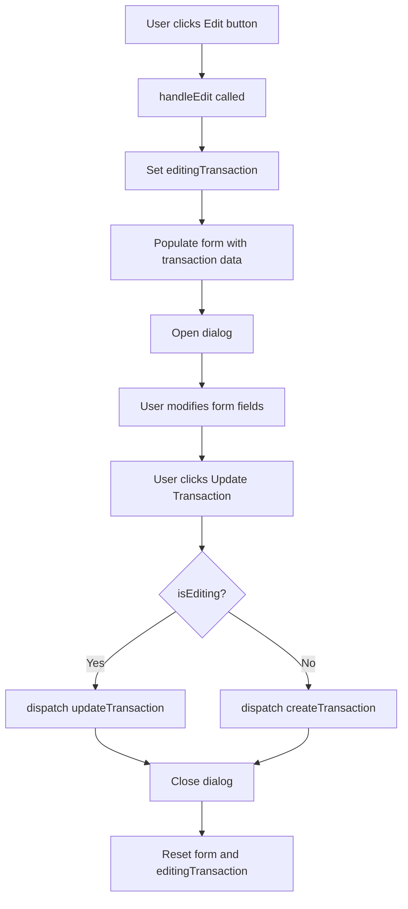

# Transaction Edit Functionality Plan

## Overview
Add the ability to edit existing transactions in the Transactions component. The backend service and Redux slice already support updating transactions, so only UI changes are needed.

## Current State
- **Backend**: [`transactionsService.update()`](src/db/services/transactionsService.ts:57) already implemented
- **Redux**: [`updateTransaction`](src/store/slices/transactionsSlice.ts:42) async thunk already implemented
- **UI**: Only create and delete functionality exists in [`Transactions.tsx`](src/features/transactions/Transactions.tsx:1)

## Implementation Plan

### 1. Add State for Edit Mode
Add new state variables to track:
- `editingTransaction`: The transaction object being edited (or null if creating)
- `isEditing`: Boolean to track whether we're in edit mode

### 2. Add Edit Button to Transaction Rows
Add an edit button next to the existing delete button in each transaction row:
- Use the `Edit` icon from lucide-react
- Show on hover (same pattern as delete button)
- Position before the delete button

### 3. Create Edit Handler Function
Create `handleEdit()` function that:
- Takes a transaction ID as parameter
- Finds the transaction in the state
- Populates the form with the transaction's data
- Opens the dialog in edit mode

### 4. Update Submit Handler
Modify `handleSubmit()` to:
- Check if we're in edit mode (`isEditing` is true)
- If editing: dispatch `updateTransaction` with the transaction ID and form data
- If creating: dispatch `createTransaction` (existing behavior)
- Close dialog and reset form after successful submission

### 5. Update Dialog Title
Dynamically change the dialog title based on mode:
- "Add New Transaction" when creating
- "Edit Transaction" when editing

### 6. Update Submit Button Text
Dynamically change the submit button text:
- "Add Transaction" when creating
- "Update Transaction" when editing

### 7. Update Form Reset Logic
When closing the dialog, ensure:
- Reset form to initial state
- Clear `editingTransaction`
- Set `isEditing` to false

## File Changes Required

### [`src/features/transactions/Transactions.tsx`](src/features/transactions/Transactions.tsx:1)

#### Imports to Add:
```typescript
import { Edit } from 'lucide-react';
import { updateTransaction } from '@/store/slices/transactionsSlice';
```

#### State to Add:
```typescript
const [editingTransaction, setEditingTransaction] = useState<Transaction | null>(null);
const isEditing = editingTransaction !== null;
```

#### Functions to Add:
```typescript
const handleEdit = (transaction: Transaction) => {
  setEditingTransaction(transaction);
  setFormData({
    accountId: transaction.accountId,
    categoryId: transaction.categoryId,
    amount: transaction.amount.toString(),
    type: transaction.type,
    date: new Date(transaction.date).toISOString().split('T')[0],
    vendor: transaction.vendor,
    notes: transaction.notes || '',
    tagIds: transaction.tagIds,
  });
  setIsOpen(true);
};
```

#### Functions to Modify:
- `handleSubmit()`: Add conditional logic for create vs update
- Add reset logic when dialog closes

#### JSX Changes:
- Add Edit button to transaction row (before Delete button)
- Update dialog title dynamically
- Update submit button text dynamically

## Flow Diagram



## Additional Considerations

### Account Balance Updates
The `transactionsService.update()` method already handles:
- Reverting the old balance change
- Applying the new balance change
- This ensures account balances remain accurate

### Form Validation
- All existing validation should remain in place
- Required fields: amount, account, category, vendor, date

### User Experience
- Edit button appears on hover (same pattern as delete)
- Dialog clearly indicates edit mode vs create mode
- Form is pre-populated with existing data
- Changes are saved immediately on submit
