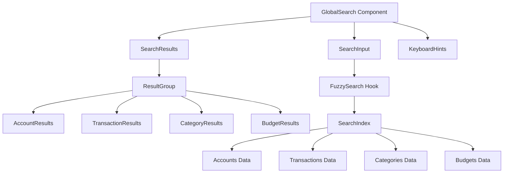
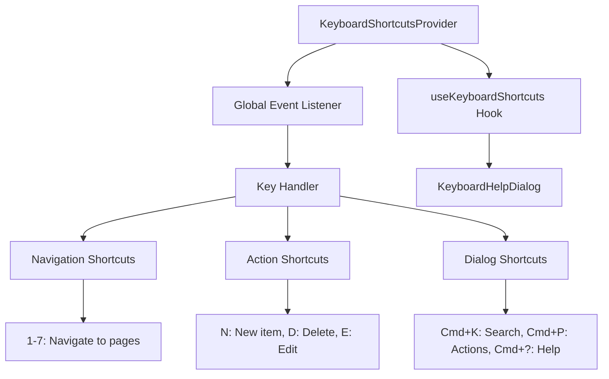

# PiggyBank UI Enhancement Plan

## Overview
This plan outlines the enhancements to make PiggyBank look amazing with beautiful styles, add comprehensive keyboard shortcuts, and implement a global search bar.

---

## Phase 1: Enhanced Styles & Beautiful UI

### Color Scheme Enhancements
- Update the primary color to a more vibrant gradient (blue to purple)
- Add success/warning/error color states with better contrast
- Implement smooth color transitions for dark mode
- Add subtle gradient backgrounds for cards and sections

### Animations & Transitions
- Add fade-in animations for page transitions
- Implement scale effects on card hover
- Add slide-in animations for modals
- Create smooth progress bar animations
- Add ripple effects on button clicks

### Card Design Improvements
- Add subtle box shadows with hover elevation
- Implement glassmorphism effects (backdrop-blur)
- Add gradient borders for important cards
- Improve spacing and padding consistency
- Add skeleton loading states

### Typography
- Use Inter font family for better readability
- Implement proper font weight hierarchy
- Add letter-spacing improvements
- Better line-height for paragraphs

---

## Phase 2: Global Search Bar (Command Palette)

### Component Architecture



### Search Features
- **Trigger**: Cmd/Ctrl+K (or Cmd+K on Mac, Ctrl+K on Windows/Linux)
- **Fuzzy search**: Match partial strings across all fields
- **Keyboard navigation**: Arrow keys to navigate, Enter to select, Esc to close
- **Result groups**: Categorized by type (Accounts, Transactions, Categories, Budgets)
- **Actions**: Navigate to item, quick edit, quick delete
- **Visual feedback**: Highlight matching text, show keyboard hints

### Keyboard Shortcuts in Search
- `↑` / `↓`: Navigate results
- `Enter`: Select result
- `Esc`: Close search
- `Tab`: Navigate between result groups

---

## Phase 3: Keyboard Shortcuts System

### Keyboard Shortcuts Provider



### Defined Shortcuts

#### Navigation
| Shortcut | Action |
|----------|--------|
| `1` | Go to Dashboard |
| `2` | Go to Accounts |
| `3` | Go to Transactions |
| `4` | Go to Categories |
| `5` | Go to Budgets |
| `6` | Go to Analytics |
| `7` | Go to Settings |

#### Global Actions
| Shortcut | Action |
|----------|--------|
| `Cmd/Ctrl+K` | Open Global Search |
| `Cmd/Ctrl+P` | Open Quick Actions |
| `Cmd/Ctrl+?` | Open Keyboard Help |
| `Esc` | Close modal/dialog |

#### Page-Specific Actions
| Shortcut | Action |
|----------|--------|
| `N` | Create new item (account, transaction, etc.) |
| `E` | Edit selected item |
| `D` | Delete selected item |
| `F` | Focus search/filter |
| `R` | Refresh data |

### Keyboard Help Dialog
- Accessible via `Cmd/Ctrl+?`
- Shows all available shortcuts grouped by category
- Highlights context-sensitive shortcuts
- Shows keyboard hints in UI buttons

---

## Phase 4: Component Styling Enhancements

### Layout Component
- Add gradient header with app logo
- Improve sidebar with active state indicators
- Add keyboard shortcut hints to nav items
- Better mobile navigation

### Dashboard
- Animated summary cards with count-up effect
- Gradient backgrounds for key metrics
- Hover effects on account and transaction items
- Smooth chart animations

### Transactions
- Better row styling with alternating colors
- Income/expense indicators with icons
- Hover actions (edit, delete) with animations
- Filter chips with keyboard navigation

### Accounts
- Card hover lift effect
- Account type icons with colored backgrounds
- Balance animation on load
- Quick action buttons

### Categories
- Color-coded category badges
- Hover effects with smooth transitions
- Drag-and-drop for reordering (future)
- Better empty state

### Budgets
- Animated progress bars
- Color-coded progress (green, yellow, red)
- Over-budget alerts with animations
- Quick edit functionality

---

## Phase 5: Polish & Testing

### Accessibility
- Ensure all interactive elements are keyboard accessible
- Add ARIA labels where needed
- Verify focus states are visible
- Test with screen readers

### Performance
- Optimize animations (use CSS transforms)
- Lazy load components where needed
- Debounce search input
- Optimize re-renders

### Dark Mode
- Ensure all colors work in dark mode
- Test gradients and shadows
- Verify contrast ratios

---

## File Structure

```
src/
├── components/
│   ├── search/
│   │   ├── GlobalSearch.tsx
│   │   ├── SearchResults.tsx
│   │   ├── SearchInput.tsx
│   │   └── useFuzzySearch.ts
│   ├── keyboard/
│   │   ├── KeyboardShortcutsProvider.tsx
│   │   ├── KeyboardHelpDialog.tsx
│   │   ├── ShortcutTooltip.tsx
│   │   ├── useKeyboardShortcuts.ts
│   │   └── shortcuts.ts
│   └── ui/
│       └── (enhanced existing components)
├── hooks/
│   └── useKeyboardNav.ts
├── styles/
│   ├── animations.css
│   └── glassmorphism.css
└── lib/
    └── fuzzySearch.ts
```

---

## Implementation Order

1. **Foundation**: Update CSS variables, add animation utilities
2. **Keyboard System**: Create provider and hook
3. **Global Search**: Build search component and fuzzy search
4. **UI Enhancements**: Update components one by one
5. **Polish**: Add tooltips, help dialog, testing

---

## Dependencies to Add

```json
{
  "fuse.js": "^7.0.0",  // Fuzzy search
  "cmdk": "^1.0.0"      // Command palette component
}
```

---

## Notes

- Never run `npm run dev` without a timeout
- Use CSS transitions for smooth animations
- Test keyboard shortcuts on both Mac and Windows
- Ensure search performance with large datasets
